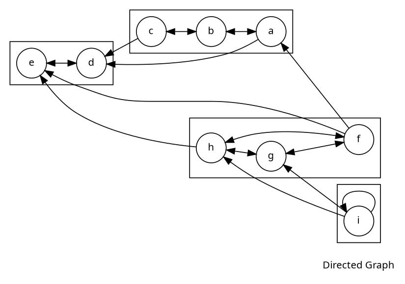
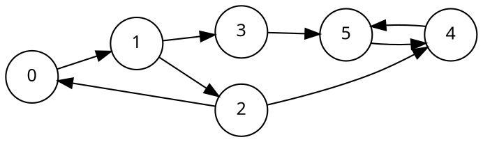

# Tarjan Algorithm

***

## Keyworks

What are SCCS
: **Strongly Connected Components** can be thought of self-connected cycles within a directed graph where every vertex in a given cycle can reach every other vertex in the same cycle.

Low-link Values
: The low-link values of a node is the smallest node id reachable from that node when doing a DFS (including itself).

Low-link value for each node(start from node 0):

| Node ID         | 0  | 1  | 2  | 3  | 4  | 5  |
| -------------   | -- | -- | -- | -- | -- | -- |
| Low-link value  | 0  | 0  | 0  | 3  | 4  | 4  |

>**Important**: Depending on where the DFS starts and which edges are visited the low-link values could be wrong. In the context of Tarjan's SCC algorithm, we maintain an invariant that prevents SCCs to interfere with each others' low-link values.

### The Stack Invariant

To cope with the random traversal order of the DFS, Tarjan's algorithm maintains a set (often as a stack) of valid nodes from which to update low-link values from. Nodes are added to the stack(set) of valid nodes as they are explored for the first time. Then nodes are removed from the stack(set) each time a complete SCC is found.  

### New low-link update condition

If u and v are nodes in a graph and we are currently exploring u then our new low-link update condition is that: to update node u's low-link value to node v's low-link value there has to be a path of edges from u to v and node v must be on the stack.

Another difference we are going to make to finding all low-link values is that instead of finding low-link values after the fact we are going to update them `on the fly` during the DFS so we can get a linear **O(V+E)** time complexity.

## Overview

- Mark the id of each node as unvisited.

- Start DFS. Upon visiting a node assign it an id and a low-link value. Also mark current nodes as visited and add them to a seen stack.

- On DFS callback, if the previous node is on the stack then min the current node's low-link value with the last node's low-link value[1](#f1).

- After visiting all neighbors, if the current node started a connected component[2](#f2) then pop nodes off stack until current node is reached.

><b id="f1">1. </b> This allows low-link values to propagate throughout cycles. [↩](#a1)
<b id="f2">2. </b> A node started a connected compoent if its id equals its low-link value. [↩](#a2)

