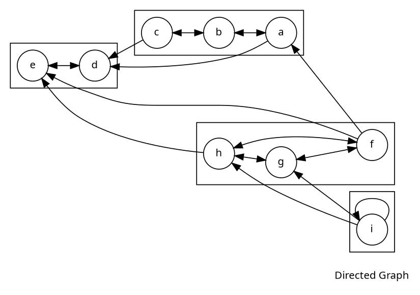

# Tarjan Algorithm

***

## What are SCCS

>**Strongly Connected Components** can be thought of self-connected cycles within a directed graph where every vertex in a given cycle can reach every other vertex in the same cycle.

## Low-link Values

>The low-link values of a node is the smallest node id reachable from that node when doing a DFS (including itself).
