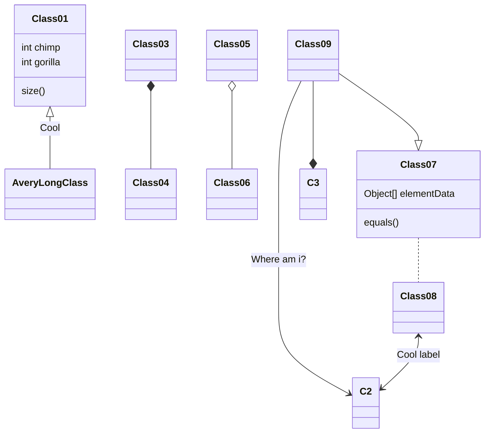

# Tarjan Algorithm with Directed Graph

## SCCS
Strongly connected components is self-contained cycles within a directed graph where every vertex in a given cycle can reach every other vertex in the same cycle. 

# Synchronization
There are two types of synchronization and they can complement each other:

- The workspace synchronization will sync all your files, folders and settings automatically. This will allow you to fetch your workspace on any other device.
	> To start syncing your workspace, just sign in with Google in the menu.

- The file synchronization will keep one file of the workspace synced with one or multiple files in **Google Drive**, **Dropbox** or **GitHub**.
	> Before starting to sync files, you must link an account in the **Synchronize** sub-menu.

<!--stackedit_data:
eyJoaXN0b3J5IjpbLTE4ODE5NTEyNDUsLTEyMjQyNDg3MDksLT
E0NzYzNzg4NTFdfQ==
-->